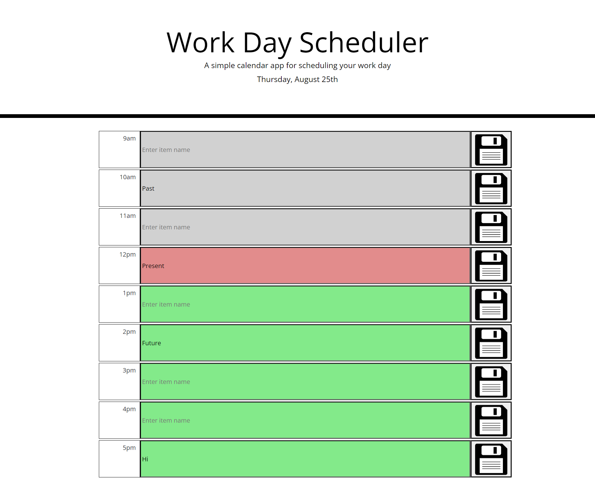

# Work Scheduler Project

## Table of contents
1. [Description](#description)
2. [Visuals](#visuals)

## Description
This is a work schedule that is dynamically updated HTML CSS webpage powered by jQuery. It uses the web API Moment.js to tell the current time to show which tasks are in the past, which are current, and which are in the future. Users can type into each row, and save their inputs by clicking the save icons. Inputs reload with page.

[Link to live site](https://bbelk.github.io/work-scheduler-project/) 

## Visuals
